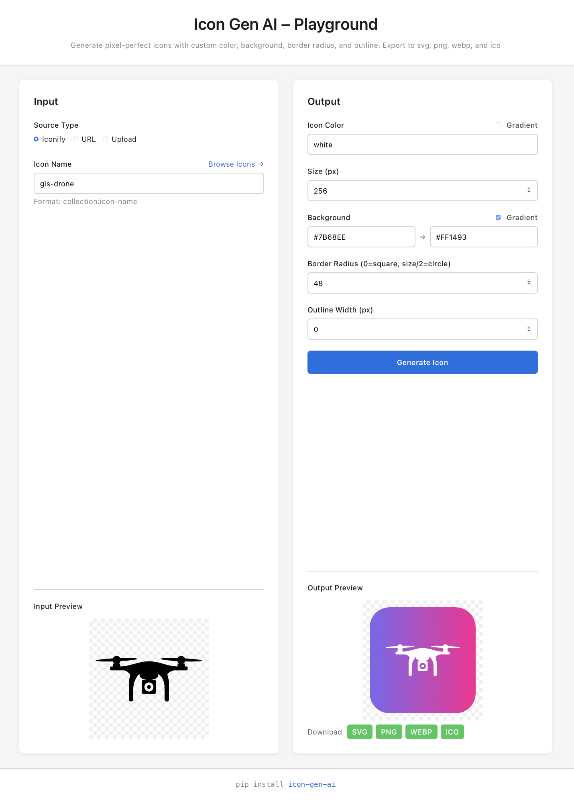

# Icon Gen AI – Playground

> **Live interactive playground for [icon-gen-ai](https://pypi.org/project/icon-gen-ai/)** - Generate pixel-perfect icons with colors, gradients, backgrounds & outlines and export to svg, png, webp, and ico.

[](https://yourusername.github.io/icon-gen-ai-playground/)
[](https://pypi.org/project/icon-gen-ai/)
[](https://huggingface.co/spaces/yauheniya/icon-gen-ai-api)

A web-based interface to explore and test the full functionality of the **icon-gen-ai** Python package. Generate custom icons from Iconify, direct URLs, or local files with real-time preview.

## Features

### Input Sources
- **Iconify Icons** - Access 275,000+ icons from [Iconify](https://icon-sets.iconify.design)
- **Direct URLs** - Fetch icons from any public URL
- **Local Upload** - Upload your own PNG or SVG files

### Customization Options
- **Icon Color** - Solid colors or gradients
- **Background** - Solid colors, gradients, or transparent
- **Size** - Any size from 16px to 512px
- **Border Radius** - Square, rounded, or circular
- **Outline** - Add colored outlines with custom width

### Benefits
- **Real-time Preview** - See input and output side-by-side
- **Instant Generation** - Generate icons in seconds
- **Download** - Export your custom icons as svg, png, webp, or ico
- **Responsive Design** - Works on desktop and mobile

## Live Demo

**Try it now:** [https://yauheniya-ai.github.io/icon-gen-ai-playground/](https://yauheniya-ai.github.io/icon-gen-ai-playground/)

## PyPI Package

This playground showcases the **icon-gen-ai** Python package:

```bash
pip install icon-gen-ai
```

**Package Repository:** [github.com/yauheniya-ai/icon-gen-ai](https://github.com/yauheniya-ai/icon-gen-ai)

## Screenshots

### Main Interface
Split-screen design with input preview on the left and customization options with output preview on the right.

<div align="center">
  
</div>

### Example Use Cases
- Generate company logos with custom backgrounds
- Create app icons with rounded corners
- Apply gradient effects to existing icons
- Add outlines for better visibility
- Recolor icons while preserving animations

## Tech Stack

**Frontend:**
- React 19
- Vite 7
- Axios
- CSS3

**Backend:**
- FastAPI
- icon-gen-ai (PyPI)
- Hosted on [Hugging Face Spaces](https://huggingface.co/spaces/yauheniya/icon-gen-ai-api)

**Deployment:**
- Frontend: GitHub Pages
- Backend: Hugging Face Spaces (Docker)

## Local Development

### Prerequisites
- Node.js 18+
- npm or yarn

### Setup

```bash
# Clone the repository
git clone https://github.com/yauheniya-ai/icon-gen-ai-playground.git
cd icon-gen-ai-playground

# Install dependencies
npm install

# Create .env file (optional, for local API)
echo "VITE_API_URL=http://localhost:8000" > .env

# Start development server
npm run dev
```

Visit [http://localhost:5173](http://localhost:5173)

### Run with Local Backend

If you want to run the backend locally:

```bash
# Clone HF Space repo (your production backend)
git clone https://huggingface.co/spaces/Yauheniya/icon-gen-ai-api
cd icon-gen-ai-api

# Install dependencies with uv
uv sync

# Run development server
uvicorn app.main:app --host 0.0.0.0 --port 7860 --reload
```

## Contributing

Contributions are welcome! Please feel free to submit a Pull Request.

### Development Guidelines
1. Follow the existing code style
2. Test your changes locally
3. Update documentation as needed
4. Submit a PR with a clear description

## 📄 License

This project is licensed under the MIT License - see the [LICENSE](LICENSE) file for details.

## Acknowledgments

- **icon-gen-ai** - Core icon generation library
- **Iconify** - Comprehensive icon collection
- **FastAPI** - Backend framework
- **Hugging Face** - Free API hosting

## Contact

- **Package Issues:** [icon-gen-ai GitHub Issues](https://github.com/yauheniya-ai/icon-gen-ai/issues)
- **Playground Issues:** [GitHub Issues](https://github.com/yauheniya-ai/icon-gen-ai-playground/issues)
- **Author:** [@yauheniya-ai](https://github.com/yauheniya-ai)
